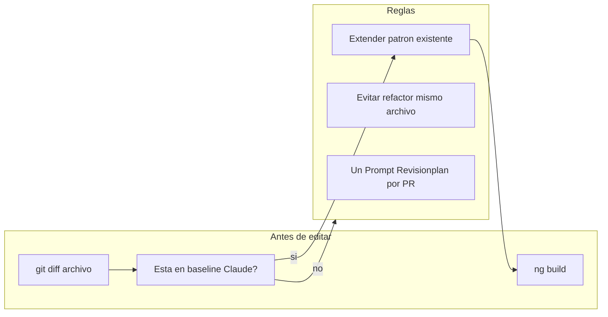

# Plan Gali v5 — Pendientes post-Cata (compatible con Claude Code)

**Fuentes:** [Correcionescata8jun.md](docs/Descubrimientos/Correcionescata8jun.md) · [Revisionplan.md](docs/Descubrimientos/Revisionplan.md)

**Principio rector:** Extender lo que Claude Code ya construyó. Evitar refactors que reescriban los mismos archivos con otra arquitectura.

---

## Baseline Claude Code — NO tocar / NO rehacer

Trabajo confirmado en terminal y `git diff` (~63 archivos, +5564 líneas). Cualquier agente debe asumir esto como **verdad actual**:

### Fase 1 Hub (Prompt 1A — COMPLETO)

| Ítem | Archivo | Estado |
|------|---------|--------|
| Objetivo editable + modal 1 paso | [home.component.html/ts](src/app/pages/gali-v5/home/home.component.html) | Hecho |
| Ciclo arriba de Decisiones (experto) | home.component.html L268–498 | Hecho |
| Toggle Básico/Experto en mode-bar | [gali-workspace-mode-bar.component.html](src/app/pages/gali-v5/components/gali-workspace-mode-bar/gali-workspace-mode-bar.component.html) | Hecho |
| FAB en header modo básico | home.component.html L73–111 | Hecho |
| Flechas ciclo + fix truncamiento | home.component.scss | Hecho |
| Copy "Señales →" | home.component.html L516–517 | Hecho |
| Tooltips PIL/ROAS en Hub | home.component.html (pTooltip) | Hecho |
| Alertas primarias Hub | `alertBannerDismissed` + `primaryAlertActive` en [gali-workspace.service.ts](src/app/pages/gali-v5/services/gali-workspace.service.ts) L106 | Hecho |
| Intent-bar se oculta con alerta | [gali-intent-bar.component.html](src/app/pages/gali-v5/components/gali-intent-bar/gali-intent-bar.component.html) L1 | Hecho |
| Mis metas + Tu plan esta semana | home.component.html L657–726 | Hecho |
| Dashboard tabs persisten (localStorage) | [home.component.ts](src/app/pages/gali-v5/home/home.component.ts) L191–245 | Hecho |

### Fase 2 Agentes + Skills (PARCIAL — 4 gaps cerrados recientemente)

| Ítem | Archivo | Estado |
|------|---------|--------|
| `launchAgent()` persiste | [agentes-page.component.ts](src/app/pages/gali-v5/pages/agentes/agentes-page.component.ts) L313–334 | Hecho |
| Botón "Crear agente" **sin** `data-proto-skip` | agentes-page.component.html L57–59 | Hecho (reciente) |
| Wizard 5 pasos (rol libre, reglas, autopilot) | agentes-page.component.html L382–534 | Hecho |
| Ontología skill en agentes-page | agentes-concept L63–105 | Hecho (reciente) |
| Diagrama orch-grid + tabs Mis Skills/Marketplace | [skills-page.component.html](src/app/pages/gali-v5/pages/skills/skills-page.component.html) | Hecho |
| Skill detail "Agentes que usan" + asignar | [gali-skill-builder-v2](src/app/pages/gali-v5/components/gali-skill-builder-v2/) | UI hecha |
| Autopilot mode-bar = solo indicador | gali-workspace-mode-bar L57–66 | Hecho |
| **Editor Nueva regla funcional** | [reglas-page.component.ts/html](src/app/pages/gali-v5/pages/reglas/) — `showNewRule`, localStorage `gali_reglas_state` | Hecho (reciente) |
| **Ontología corregida en reglas-page** | reglas-page copy skill ≠ regla | Hecho (reciente) |

### Fase 3 Proyectos + Onboarding (MAYORMENTE HECHO)

| Ítem | Archivo | Estado |
|------|---------|--------|
| Calculadora, presupuesto Gali, agentes en launch | [nuevo-proyecto-page](src/app/pages/gali-v5/pages/proyectos/nuevo-proyecto-page.component.html) | Hecho |
| Modal lanzamiento + toast borrador | nuevo-proyecto-page | Hecho |
| Mock `recien_lanzado`, `campaña_fallida`, `borrador` | [mocks/gali-v5/projects.json](mocks/gali-v5/projects.json) | Hecho |
| Deep links `?signalId=` | proyecto-detalle + senales-page | Hecho |
| Acciones del proyecto (timeline) | proyecto-detalle-page | Hecho |
| Onboarding pedidos pre-relleno | [gali-goal-onboarding](src/app/pages/gali-v5/components/gali-goal-onboarding/) | Hecho |
| Señales Lanzar/Medir/Operar | [senales-page.component.html](src/app/pages/gali-v5/pages/senales/senales-page.component.html) L18–26 | Hecho |

### Otros módulos con trabajo Claude activo (EXTENDER, no reemplazar)

- [wallet-page](src/app/pages/gali-v5/pages/financiero/wallet-page.component.ts) — +445 líneas SCSS
- [micromundo-page](src/app/pages/gali-v5/pages/micromundo/) — grafo SVG reescrito
- [marketplace-page](src/app/pages/gali-v5/pages/marketplace/) — tabs y estilos nuevos
- [reglas-page](src/app/pages/gali-v5/pages/reglas/) — editor + escalamiento Roax
- [senales-page](src/app/pages/gali-v5/pages/senales/) — header y filtros
- [gali-workspace.service.ts](src/app/pages/gali-v5/services/gali-workspace.service.ts) — `primaryAlertActive`, `updateGoalLabel`

---

## Protocolo de convivencia entre agentes



1. **Seguir orden del Revisionplan** — Claude iba a ejecutar **Prompt 1B** a continuación. No saltar a Sprint 5 ni refactorizar `skill-editor` antes de 1C.
2. **Un prompt = un build verde** — igual que [Revisionplan.md L346](docs/Descubrimientos/Revisionplan.md).
3. **No crear servicios duplicados** — usar `GaliWorkspaceService.primaryAlertActive` ya existente; no introducir `GaliAlertPriorityService` paralelo sin migrar el Hub.
4. **No extraer componentes del Hub** — p. ej. NO extraer `AgentThresholdPanel` del panel umbrales del Hub; cablear los sliders que ya existen en `agentes-page` L297–337.
5. **No borrar rutas ni layouts** — `skills-comunidad-page` y `skill-editor-page` pipeline: enfoque **aditivo** (nuevo tab/modo), no delete masivo.
6. **Respetar `localStorage` keys** — `gali_reglas_state`, `gali_dashboard_tabs`, `gali_goal_*`, `gali_active_tab`: no renombrar sin migración.
7. **Antes de commit conjunto** — quien implemente debe `git diff` los 63 archivos del baseline y resolver conflictos solo en su zona asignada.
8. **Leer skills del momento** — antes de codear cada prompt, cargar las skills indicadas en la tabla siguiente (regla del repo + skills Cursor/proyecto).

### Zonas de ownership sugeridas (evitar pisarse)

| Zona | Archivos "calientes" | Quien continúa |
|------|---------------------|----------------|
| Hub + shell | home.*, gali-v5-shell.*, gali-intent-bar.*, mode-bar.* | Prompts 1B, 1C, 3C |
| Agentes | agentes-page.* | Prompt 2A (cableado umbrales, skill picker) |
| Skills | skills-page.*, gali-skill-builder-v2.*, skill-editor.* | Prompt 2B incremental |
| Reglas | reglas-page.* | **Congelado** salvo copy menor — Claude acaba de cerrar |
| Proyectos | nuevo-proyecto.*, proyectos-list.*, proyecto-detalle.* | Prompt 3B |
| Transversal | gali-workspace.service.ts, senales.mock.ts | Prompt 1C |
| Secundarios | micromundo, marketplace, wallet, conexiones | Sprint 5, tras commit |

---

## Skills a usar según el momento

Regla global del repo (siempre, antes de UI): leer [ds-registry/index.json](ds-registry/index.json) + specs de componentes que toques + [CLAUDE.md](CLAUDE.md) (tokens en `_variables.scss`, tipografías Inter/IBM Plex).

| Momento / Prompt | Skills (leer antes de codear) | Para qué |
|------------------|-------------------------------|----------|
| **Cualquier UI nueva o copy visible** | `ui-typography` | Tooltips, botones, metas, reglas — tipografía correcta en español |
| **Antes de cada sprint** | `vanity-engineering-review` (lectura rápida) | Evitar servicios/componentes de más; validar enfoque aditivo vs refactor |
| **Prompt 1B** — diagnóstico cruzado | `ui-typography` + `design-audit` (modo AUDIT en diagnóstico-modal) | Tooltips ⓘ en hipótesis; verificar jerarquía y scroll sin tocar Hub |
| **Prompt 1C** — alertas transversales | `human-architect-mindset` o `negentropy-lens` + `interface-design` | Decidir extender `primaryAlertActive` vs inventar servicio; 1 banner primario por vista |
| **Prompt 1C** — glosario + "Ver qué hizo Gali" | `ui-typography` + `adaptive-communication` | Copy en lenguaje dropshipper principiante; resúmenes antes/después claros |
| **Prompt 2A** — cablear umbrales / skill picker | `vanity-engineering-review` + `interface-design` | Modal picker mínimo; no extraer panel del Hub |
| **Prompt 2B** — ontología skill / tab Capacidad | `negentropy-lens` + Spec 11 (cuando exista) | Fijar skill ≠ agente sin borrar pipeline legacy |
| **Prompt 2B** — tipografías skills/marketplace | `design-audit` + `redesign-existing-projects` (proyecto) | Alinear [skills-comunidad-page.scss](src/app/pages/gali-v5/pages/skills/skills-comunidad-page.component.scss) al DS sin rediseño total |
| **Prompt 2C** — autopilot right-panel | `agentic-ux-design-relationship-centric-interfaces` | Autopilot como confianza por agente, no toggle suelto en chat |
| **Prompts 3A–3B** — proyectos + onboarding | `agentic-ux-design-relationship-centric-interfaces` + `ui-typography` | Flujo guiado, saltar pasos según datos Dropi, copy empático |
| **Prompt 3A** — búsqueda IA producto | `interface-design` + `adaptive-communication` | Conversación por características sin reemplazar cards ADA |
| **Prompt 3C** — personalizar ciclo / tabs | `interface-design` | Tabs persistentes ya existen — solo UX del customizer |
| **Fase 4** — chat rico / multi-thread | `interface-design` + `agentic-ux-design-relationship-centric-interfaces` | Workspace tipo Cursor; threads por contexto, no chatbot único |
| **Fase 4** — dashboard widgets Hub | `design-taste-frontend` (proyecto: `.claude/skills/design-taste-frontend`) | Widgets sin estética genérica; respetar DS Dropi |
| **Fase 5** — micromundo grafo | `renaissance-architecture` + `interface-design` | Evaluar D3/ngx-graph vs extender SVG de Claude |
| **Fase 5** — marketplace MCP / conexiones | `negentropy-lens` + `design-audit` | Marketplace expandido sin "marketplace dentro de marketplace" |
| **Fase 5** — pulido visual módulos | `design-audit` + `redesign-existing-projects` | wallet, senales, chatea-pro — saturación y DS |
| **Documentar Spec 8–15** | `human-architect-mindset` | Objetivos, ontología, alertas, workspace chat — antes de Fase 4–5 |
| **Dividir trabajo entre agentes** | `split-to-prs` | Un prompt = un PR; no mezclar zonas de ownership |
| **PR listo para merge** | `babysit` | Tras cada sprint con `ng build` verde |

### Skills del proyecto Dropi (priorizar sobre genéricas)

Cuando el skill genérico y el del repo se solapan, usar el del repo:

| Skill proyecto | Ruta | Cuándo |
|----------------|------|--------|
| `design-taste-frontend` | [.claude/skills/design-taste-frontend/SKILL.md](.claude/skills/design-taste-frontend/SKILL.md) | Hub polish, Fase 4 widgets, cualquier pantalla que "se sienta plantilla" |
| `redesign-existing-projects` | [.claude/skills/redesign-existing-projects/SKILL.md](.claude/skills/redesign-existing-projects/SKILL.md) | skills-comunidad, marketplace, wallet — audit-first, diff mínimo |
| `full-output-enforcement` | [.claude/skills/full-output-enforcement/SKILL.md](.claude/skills/full-output-enforcement/SKILL.md) | Si un prompt genera HTML/SCSS largo (wizard 6 pasos, skill-editor tab) — evitar placeholders |

### Skills que NO usar en este plan

| Skill | Motivo |
|-------|--------|
| `figma-use` / `figma-generate-design` | No hay push a Figma en estos prompts; diseño ya está en código |
| `image-to-code` / `imagegen-*` | Prototipo Angular existente, no landing desde cero |
| `gpt-taste` / `industrial-brutalist-ui` | Estética incompatible con DS Dropi (naranja, Inter) |
| `organic-first-campaign` | Fuera de alcance producto |

### Checklist por agente al iniciar un prompt

1. `git diff` en zona de ownership
2. Leer skills de la fila correspondiente en la tabla
3. Leer DS Registry si hay UI
4. Implementar enfoque **aditivo** (plan compatible Claude)
5. `ng build`
6. Si abre PR: `babysit` o revisión con `vanity-engineering-review`

---

## Pendientes reales (ajustados — sin duplicar trabajo Claude)

**Estado revisado:** Hub ~90% · Agentes ~70% · Skills/Reglas ~65% · Proyectos ~75% · Transversal ~30% · Secundarios ~40%

### Siguiente bloque — Continuar Revisionplan (Fase 1)

#### Prompt 1B — Pendiente menor (Claude estaba por ejecutarlo)

Ya hecho en 1B: doble chat eliminado, "Señales →", PIL/ROAS en Hub.

**Solo falta verificar/completar:**

- Tooltip "diagnóstico cruzado" si aparece en Hub (hoy PIL/ROAS sí; diagnóstico está en [diagnostico-modal](src/app/pages/gali-v5/components/diagnostico-modal/))
- Scroll mouse en diagnóstico cruzado — overflow ya en `diagnostico-modal.component.scss` L148–152; validar en runtime

**Archivos:** solo `diagnostico-modal.*` — **no tocar** `home.component.html` salvo añadir link/tooltip si falta.

#### Prompt 1C — Extender alertas (NO reimplementar Hub)

**Enfoque compatible:** reutilizar `ws.primaryAlertActive` que Hub ya setea en [home.component.ts](src/app/pages/gali-v5/home/home.component.ts) L877.

| Acción | Cómo (sin romper Hub) |
|--------|----------------------|
| 1 primaria por vista | Cada página llama `ws.setPrimaryAlertActive(true)` en `ngOnInit` si tiene banner crítico; `false` en destroy |
| Intent-bar suprimido | Ya funciona vía `gali-intent-bar` — solo propagar el signal desde otras páginas |
| Ver qué hizo Gali | Añadir campo `resolucionResumen` en [senales.mock.ts](mocks/gali-v5/senales.mock.ts); copiar patrón de [proyecto-detalle L49](src/app/pages/gali-v5/pages/proyecto/proyecto-detalle-page.component.html) |

**Páginas piloto (en este orden):** wallet → dashboard-financiero → novedades/logística. **No modificar** la lógica `alertBannerDismissed` del Hub.

**Glosario transversal (parte de 1C):** extraer `term-info` + `pTooltip` del Hub a componente shared `GaliTermTooltip` — **copiar estilos** de [home.component.scss](src/app/pages/gali-v5/home/home.component.scss) `.term-info`, no reinventar.

---

### Fase 2 — Incremental (no destructivo)

#### 2A Skills — Modo capacidad aditivo (NO borrar skill-editor)

Claude ya fijó ontología en listados y reglas. **No volver a editar copy de reglas-page.**

| Pendiente | Enfoque seguro |
|-----------|----------------|
| skill-editor aún tiene TRIGGER/CONDICIÓN/ACCIÓN | Añadir tab "Capacidad" (qué hace + agentes) **junto a** tab "Pipeline avanzado" legacy; deprecar pipeline en copy, no en código aún |
| `skills-page.component.ts` modelo con `trigger` | Mantener campo; ocultar en UI del listado (ya parcial en L139) |
| Asignar skill no persiste | Completar handler en [gali-skill-builder-v2](src/app/pages/gali-v5/components/gali-skill-builder-v2/gali-skill-builder-v2.component.ts) L65 — guardar en signal/localStorage |
| skills-comunidad tipografías | Solo SCSS tokens en [skills-comunidad-page.scss](src/app/pages/gali-v5/pages/skills/skills-comunidad-page.component.scss) — sin cambiar HTML |

#### 2B Agentes — Cableado, no re-arquitectura

| Pendiente | Enfoque seguro |
|-----------|----------------|
| Umbrales con `data-proto-skip` L312–323 | Quitar skip y conectar a signals locales del agente seleccionado — **misma UI**, sin extraer componente del Hub |
| Agregar skill → `/skills` | Añadir `SkillPickerModal` **nuevo archivo**; mantener `routerLink` como fallback hasta probar modal |
| CTA duplicado crear agente L163–166 | Evaluar si es entrada secundaria válida; si se quita, solo ocultar visualmente, no borrar lógica |
| Paso conexiones en wizard | **Paso 6 opcional** al final — no renumerar pasos 1–5 existentes |
| Autopilot en right-panel | Reducir a link "Configurar en Agentes" — no eliminar bloque entero de golpe (evitar conflictos con threads multi-chat) |

---

### Fase 3 — Proyectos y onboarding (merge con mocks existentes)

| Pendiente | Enfoque seguro |
|-----------|----------------|
| Lista no usa `projects.json` | En [proyectos-list-page.component.ts](src/app/pages/gali-v5/pages/proyectos/proyectos-list-page.component.ts): **importar JSON y mergear** con array local — no reemplazar filtros que Claude tocó |
| Búsqueda IA conversacional | Añadir panel en `nuevo-proyecto` discovery **al lado** de cards ADA existentes — no quitar `np-ada-rec-card` |
| Onboarding saltar pedidos si kpi=0 | Condicional en [gali-goal-onboarding.component.ts](src/app/pages/gali-v5/components/gali-goal-onboarding/gali-goal-onboarding.component.ts) — no eliminar el paso del wizard |
| "Editar plan" abre modal objetivo | Cambiar handler a mini-editor 3 ítems — **no tocar** `openEditGoal()` del goal strip |
| Personalizar ciclo `data-proto-skip` | Solo quitar skip en botón L277 — tabs ya persisten vía `dashboardTabs` |

---

### Fase 4–5 — Diferir hasta commit estable

No iniciar hasta que el diff actual de Claude esté commiteado o acordado:

- Chat rico / gráficos ROAS en right-panel (25 `data-proto-skip` — activar tab por tab)
- Multi-chat carpetas/pin (extender `threads` signal existente)
- Grafo Obsidian en micromundo (Claude acaba de reescribir SVG — iterar encima)
- Marketplace MCP tabs (Claude añadió +253 SCSS — completar CTAs, no rediseñar)
- Transportadoras, red problemas catálogo, Chatea Pro profundo

---

## Orden de ejecución (alineado con Claude Code)

```
[HECHO] Prompt 1A — Hub reorder + objetivo + FAB + alertas Hub
[HECHO] Gaps Claude — crear agente, ontología agentes/reglas, editor nueva regla
        → ng build ✅

[SIGUIENTE] Prompt 1B — verificar diagnóstico cruzado tooltips/scroll
        skills: ui-typography, design-audit
        → ng build ✅

[LUEGO] Prompt 1C — extender primaryAlertActive + Ver qué hizo Gali + glosario shared
        skills: negentropy-lens, interface-design, ui-typography, adaptive-communication
        → ng build ✅

[LUEGO] Prompt 2A — agentes cableado umbrales + skill picker modal (aditivo)
        skills: vanity-engineering-review, interface-design
        → ng build ✅

[LUEGO] Prompt 2B — skill-editor tab Capacidad + persist asignación skill
        skills: negentropy-lens, design-audit, redesign-existing-projects
        → ng build ✅

[LUEGO] Prompt 2C — autopilot link-only en right-panel
        skills: agentic-ux-design-relationship-centric-interfaces
        → ng build ✅

[LUEGO] Prompts 3A–3C — proyectos JSON merge, onboarding condicional, personalizar sin skip
        skills: agentic-ux-design-relationship-centric-interfaces, ui-typography, interface-design
        → ng build ✅

[DESPUÉS] Fase 4–5 — tras commit del baseline Claude
        skills: design-taste-frontend, renaissance-architecture, design-audit
```

---

## Qué eliminamos del plan anterior (para no romper)

| Propuesta anterior | Por qué se cancela / cambia |
|--------------------|----------------------------|
| Crear `GaliAlertPriorityService` nuevo | Duplica `primaryAlertActive` en `gali-workspace.service` |
| Refactor total `skill-editor` (borrar pipeline) | Riesgo alto de conflicto; Claude no lo tocó aún |
| "Corregir copy reglas-page" | Claude ya lo hizo — regresión |
| "Quitar data-proto-skip Crear agente" | Claude ya lo hizo |
| Extraer `AgentThresholdPanel` del Hub | Refactor innecesario; cablear sliders in-place |
| Reemplazar array hardcodeado proyectos-list | Merge con JSON, no replace |
| Deprecar `skills-comunidad-page` | Ruta activa con trabajo reciente en HTML |

---

## Matriz Cata → acción (actualizada)

| Feedback Cata | Estado | Siguiente acción |
|---------------|--------|------------------|
| Hub objetivo / ciclo / modos | Hecho | — |
| Alertas acumuladas fuera Hub | Pendiente | Prompt 1C extendiendo `primaryAlertActive` |
| PIL/ROAS/huella sin explicar | Parcial | `GaliTermTooltip` shared post-1C |
| Ver qué hizo Gali | Parcial | Prompt 1C + senales.mock |
| Skill ≠ agente en editor | Pendiente | Tab Capacidad aditivo (2B) |
| Umbrales en Agentes no funcionan | Pendiente | Cablear sliders (2A), no refactor Hub |
| Crear agente / reglas libres | Hecho | — |
| Proyectos sin variedad en lista | Pendiente | Merge projects.json (3A) |
| Onboarding pedidos absurdo | Parcial | Saltar paso si kpi=0 (3B) |
| Chat workspace IA | Parcial | Fase 4 tras commit |
| Grafo / marketplace MCP | Parcial | Fase 5 — extender trabajo Claude en micromundo/marketplace |

---

## Specs nuevos — crear solo si bloquean Fase 4–5

| Spec | Cuándo |
|------|--------|
| Spec 14 AlertasUnificadas | Antes de Prompt 1C si se documenta contrato de `primaryAlertActive` |
| Spec 11 OntologiaAgentes | Antes de tab Capacidad en skill-editor |
| Spec 12–15 | Fase 4–5 únicamente |
